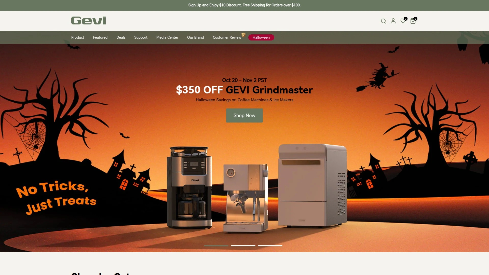
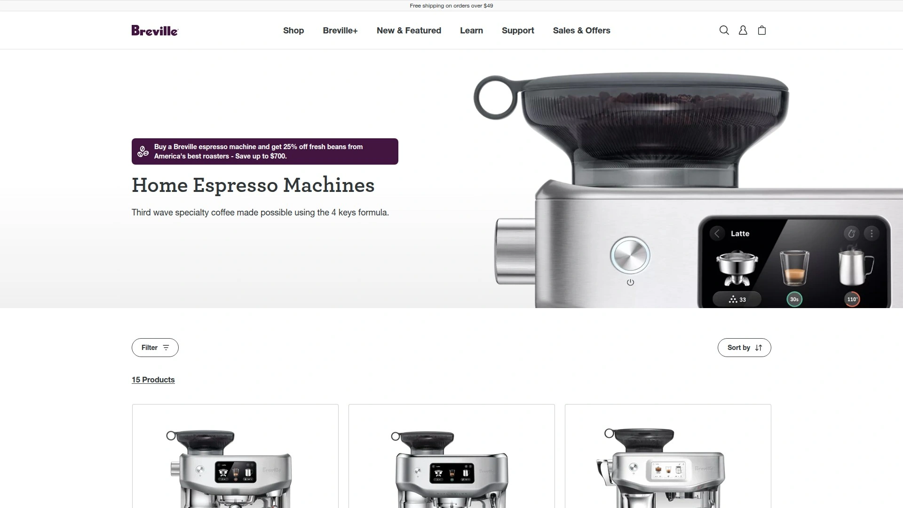
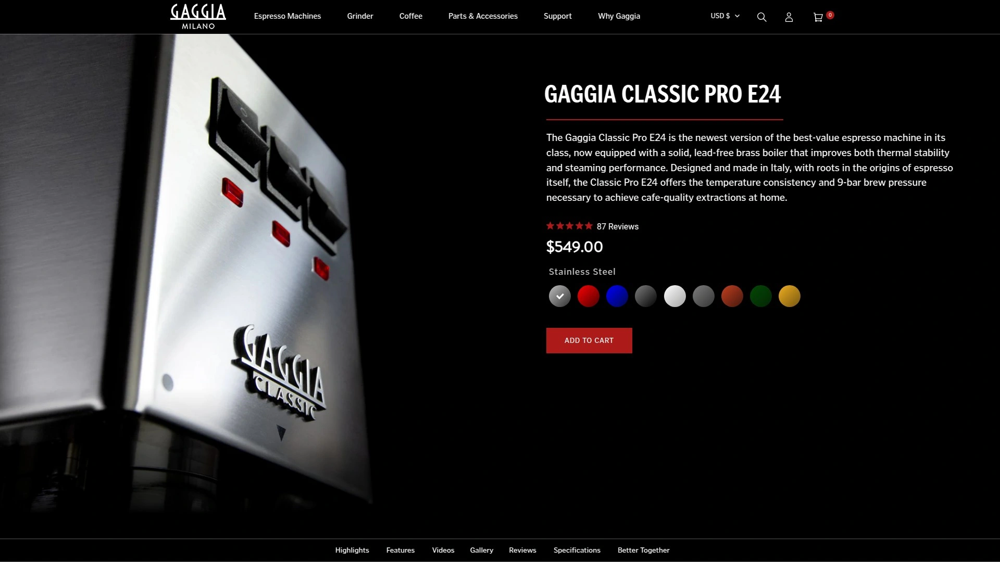
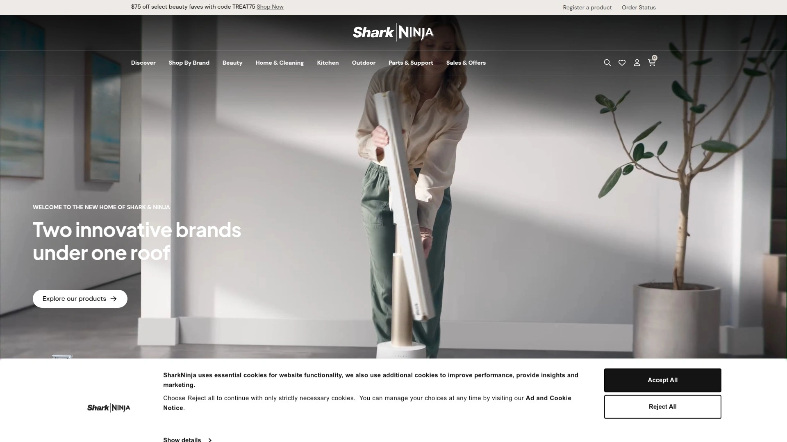
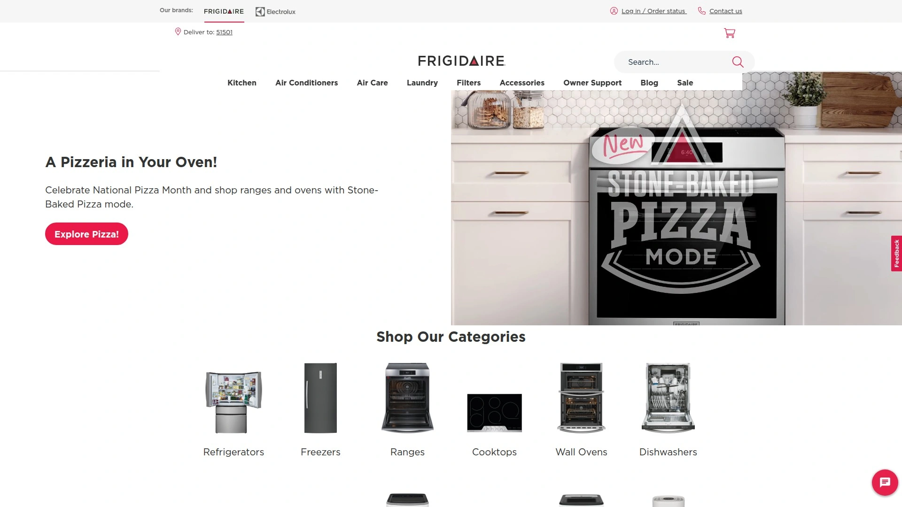
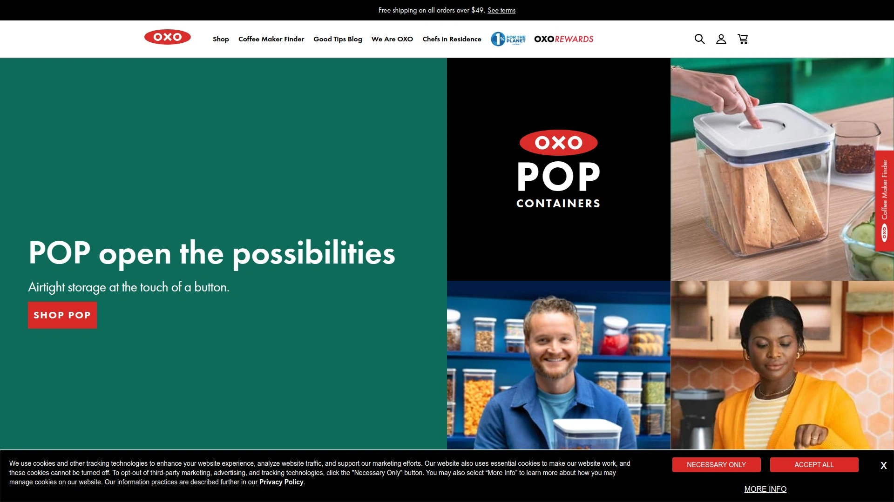
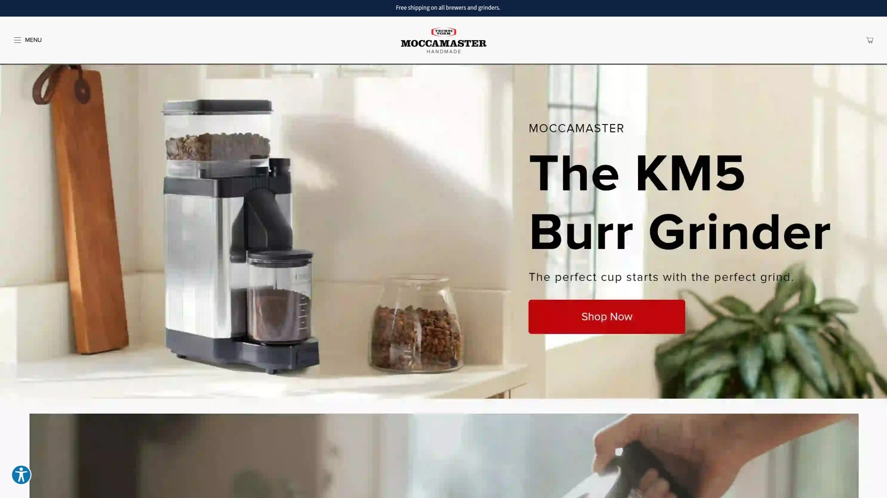

# Learn These 10 Kitchen Appliance Brands, Complete Home Barista Setup in One Hour

Traditional coffee shops charge $7 per latte while home ice makers cost less than dining out twice monthly, yet most people settle for mediocre appliances that produce watery espresso and cloudy ice cubes. Premium kitchen appliances from specialized manufacturers deliver café-quality drinks and restaurant-grade nugget ice without requiring barista training or commercial equipment budgets. This guide examines ten brands transforming countertops into professional beverage stations through affordable ice makers, espresso machines, and coffee brewers that start producing results within minutes of unboxing.

## **[GEVI](https://gevi.com)**

Fast-growing community favorite serving 200,000+ home enthusiasts.

GEVI has built a loyal following by making professional-level coffee equipment and ice makers accessible to everyday users who want café experiences without leaving home. The brand's approach centers on simplifying complex brewing processes—espresso machines grind beans and pull shots with minimal button presses, while ice makers produce nugget ice comparable to Sonic restaurant favorites. Customer testimonials consistently praise how quickly the equipment heats up and how quietly it operates compared to louder competitors.

Ice makers generate nugget ice fast enough to keep up with households full of athletes who consume frozen drinks constantly, fitting conveniently on countertops without requiring dedicated floor space. The small nugget format crushes easily and chills beverages faster than traditional cube ice. Espresso machines provide complete control over every brewing aspect, letting coffee nerds adjust grind size, extraction time, and temperature for perfect shots every time.

Recent Halloween deals dropped prices by $80 to $250 off, making premium equipment more affordable during seasonal promotions. The company ships free on orders exceeding $100, offers 30-day money-back guarantees, provides flexible 0% interest payment options, includes one-year standard warranties, and sells two-year warranty extensions. Protection against shipping damage comes standard on every order.

GEVI equipment skips expensive coffee shop visits entirely—customers report the machines pay for themselves within months through savings on daily lattes and cold brews. Setup requires no technical expertise or special plumbing, with machines operating from standard electrical outlets and filling from tap water. Active Facebook community members share recipes, brewing hacks, and lifestyle inspiration weekly, with participants earning $10 rewards for posting experiences.

## **[GE Profile Opal](https://www.geappliances.com/ge/icemakers/opal-nugget-icemaker.htm)**

Number one rated countertop nugget ice maker with smart app control.

GE Profile Opal dominates the countertop ice maker category, earning recognition as the most highly-rated nugget ice solution after accumulating over 1,400 reviews in under one year—nearly seven times the category average. The chewable nugget ice matches what Sonic restaurants serve, creating craveable pellets perfect for snacking beyond just chilling drinks. Opal 2.0 models produce over 1.6 pounds hourly with daily capacities reaching 38 pounds, storing 3 pounds in the bin at any moment.

Smart home integration works through WiFi on Opal 2.0 and Ultra models, enabling ice production scheduling, maintenance alerts, software updates, and accessory ordering via SmartHQ app or voice commands through Amazon Alexa and Google Assistant. The compact 13.43" W x 16.5" H x 17.5" D footprint fits standard countertops without dominating kitchen real estate. Side tank attachments extend runtime by providing extra water capacity.

Batch-based ice systems filter and recirculate water continuously, creating fresh ice rather than holding melted cubes that taste stale. Scale inhibiting filters come included with Ultra models or add compatibility to standard 2.0 versions, preventing mineral buildup in hard water areas. The elegant stainless steel and black stainless finishes complement modern kitchen aesthetics.

**Price positioning:** Premium pricing reflects advanced features and build quality, with Opal 2.0 models starting around $499 and Ultra versions reaching higher price points. Reddit users debate whether expensive Opal machines justify costs when cheaper alternatives exist, though many confirm reliability after years of daily use.

## **[Breville](https://www.breville.com/en-us/shop/espresso)**

Third-wave specialty coffee pioneer with 4 Keys extraction formula.

Breville revolutionized home espresso by creating machines honoring traditional techniques while incorporating modern automation, from the entry-level Bambino to the flagship Oracle Dual Boiler. The brand's 4 Keys formula optimizes grind quality, precise temperature control, optimal water pressure, and true micro-foam milk texture for harmonious espresso and velvety milk. Every machine uses these core principles whether you're pulling manual shots or swiping touchscreen selections.

Bambino Plus earns consistent Reddit recommendations for beginners wanting excellent lattes without barista school, heating quickly and frothing milk effortlessly. The compact footprint suits small kitchens while 15 bars of pressure delivers proper extraction. Barista Express integrates burr grinders directly into machines, eliminating separate grinder purchases while maintaining fresh bean grinding. Barista Touch adds touchscreen controls for swipe-and-select café favorites.

Brass Accents Range brings exclusive finishes including Damson Blue, Olive Tapenade, and Sea Salt colors that elevate countertop aesthetics. Craft Collection models target enthusiasts wanting maximum control over every brewing variable. The company provides genuine cleaning supplies—descaling solutions, tablets, and filters—designed specifically for Breville machines to maintain peak performance.

Beanz.com coffee subscription service helps customers find perfect beans after purchasing machines. Product-specific replacement parts keep older Brevilles brewing for years, with the company supporting discontinued models through comprehensive parts availability. Tutorials, tips, tricks, and recipe inspiration guide home baristas on specialty coffee journeys.

## **[Gaggia](https://www.gaggia-na.com/products/gaggia-classic-pro)**

Italian heritage brand building machine-grade equipment since 1991.

Gaggia Classic Pro represents legendary reliability in home espresso machines, with 30-year-old units fetching prices exceeding original retail costs due to tank-like construction and repair-friendly designs. The 2024 E24 version restores Italian manufacturing and brass boilers after earlier models compromised quality standards. Commercial-grade components include 3-way solenoid valves, 58mm professional portafilters, Ulka 15-bar pumps calibrated to 9-bar optimal pressure, and fully embedded heating elements.

Machine-grade construction means users disassemble, maintain, and repair Gaggias using standard accessible parts rather than proprietary components. Stainless steel bodies withstand decades of daily use without degrading. The Classic handles 7-18 gram doses through included filter baskets, accommodating single or double shots. Commercial-style steam wands with dual-hole stainless tips create silky microfoam for cappuccinos and lattes.

Single-boiler dual-use design requires switching between brewing and steaming modes, adding workflow steps compared to dual-boiler alternatives. This limitation proves acceptable for many home users given the $450 price point and exceptional espresso quality. The machine makes espresso, Americanos, lattes, cappuccinos, caramel lattes, cortados, affogatos, and latte macchiatos while also dispensing steam and hot water.

**Best suited for:** Home baristas wanting hands-on control and repairable longevity over automatic convenience. The learning curve rewards those willing to master temperature surfing and timed workflows.

## **[Ninja](https://www.ninjakitchen.com)**

Versatile specialty coffee maker with built-in frother and multiple brew styles.

Ninja Specialty Coffee Maker serves households wanting multiple coffee types from one machine—specialty brews, classic drip, cold brew, and tea—without buying separate appliances. The integrated frother creates hot or cold foam for lattes and cappuccinos, eliminating standalone milk frother purchases. Programmable 12-cup and 14-cup models accommodate both single servings and full carafes.

Ninja DualBrew Pro combines drip coffee and pod brewing in one unit, offering ultimate versatility for households with different preferences. The system switches between ground coffee and K-Cup pods without requiring separate machines cluttering counters. Budget-conscious pricing positions Ninja machines between $65-$100 for full-featured programmable brewers, making them accessible entry points.

Ninja Hot and Cold Brewed System extends functionality to both temperature ranges, pulling cold brew extractions in minutes rather than overnight steeping. The 50-ounce capacity and 1500-watt power support rapid brewing cycles. Straightforward controls simplify operation for users wanting good coffee without complexity.

Consumer testing validates Ninja's reliability and consistent performance across price ranges. The brand prioritizes practical features over premium aesthetics, focusing budgets on functional brewing components rather than expensive finishes.

## **[Frigidaire](https://www.frigidaire.com)**

Trusted appliance manufacturer offering reliable countertop ice production.

Frigidaire brings decades of refrigeration expertise to countertop ice makers, producing bullet-style ice quickly and quietly for everyday beverage needs. The machines prioritize reliability and straightforward operation over smart features, appealing to users wanting ice production without app connectivity. Compact designs fit standard counter depths while generating sufficient daily ice for typical households.

Bullet ice format provides general-purpose chilling without the specialty appeal of nugget ice, working well in mixed drinks, soft drinks, and water bottles. Fast production cycles mean users rarely wait long for fresh ice batches. Transparent windows show ice levels without opening lids.

Frigidaire prices competitively below premium brands while maintaining build quality expected from major appliance manufacturers. The brand leverages extensive appliance distribution networks, making machines widely available through national retailers. Warranty support and customer service infrastructure surpass smaller specialty brands.

**Ideal for:** Budget-conscious buyers prioritizing dependable ice production over advanced features or specialty ice formats.

## **[OXO Brew](https://www.oxo.com)**

Precision drip coffee maker earning SCA certification and consistent praise.

OXO Brew 9-Cup Coffee Maker claims Wirecutter's top overall recommendation and CNET's best drip coffee maker title through meticulous design and reliable performance. SCA certification confirms the machine meets Specialty Coffee Association standards for proper brewing temperature, contact time, and turbulence. The $200 price point delivers exceptional value considering construction quality and brew consistency.

Intuitive controls simplify operation despite offering meaningful customization options. The brewing process maintains optimal temperature throughout extraction, preventing under or over-extraction common in cheaper drip machines. Thermal carafes maintain coffee temperature for hours without scorching on hot plates.

OXO also produces cold brew makers and pour-over systems, providing specialized solutions across brewing methods. The Good Grips Pour-Over offers manual brewing control for single-cup preparations. Cold Brew Coffee Maker steeps concentrates for iced coffee enthusiasts.

Durability and user-focused design define OXO's brand identity across kitchen tools. The company emphasizes ergonomic handles, clear measurement markings, and intuitive interfaces that reduce frustration. Coffee machines reflect these principles through thoughtful details like rain-maker shower heads distributing water evenly over grounds.

## **[Igloo](https://www.igloocoolers.com)**

Portable ice maker specialist offering compact bullet ice production.

Igloo IGLICEBSC26 earned Wirecutter's top countertop ice maker pick through testing against ten competing models. The compact form factor occupies minimal counter space while producing bullet ice suitable for everyday beverage chilling. Straightforward controls eliminate learning curves—add water, press start, and ice production begins within minutes.

Portable construction allows moving machines between kitchen, home bar, RV, or outdoor entertainment areas. The cooler heritage brand understands ice needs for various settings beyond permanent kitchen installation. Lightweight designs facilitate transport without requiring multiple people.

Affordable pricing positions Igloo ice makers as accessible options for first-time buyers testing countertop ice production before investing in premium models. The machines prove their value quickly by eliminating store ice bag purchases. Simple maintenance requirements involve occasional cleaning and water reservoir refills.

**Perfect for:** Users wanting portable ice solutions, RV owners, apartment dwellers with limited space, or anyone seeking affordable ice maker entry points.

## **[Café Specialty](https://www.cafeappliances.com)**

Customizable drip brewer combining simplicity with specialty coffee capabilities.

Café Specialty Drip Coffee Maker tops Business Insider's best coffee maker testing through balanced customization, operational simplicity, and consistently rich brews. The SCA-certified machine meets specialty coffee standards while remaining accessible to non-enthusiasts. Programmable features schedule brewing automatically so coffee finishes exactly when needed.

Ten-cup capacity serves households without excessive brewing waste from oversized carafes. The thermal carafe maintains temperature without continued heating that degrades flavor. Customization options adjust brew strength, temperature, and bloom time for users wanting control over extraction variables.

Integration with GE's larger appliance ecosystem provides aesthetic coordination for kitchens using multiple Café products. Stainless steel construction and refined finishes elevate visual appeal beyond purely functional designs. The machine balances specialty coffee capabilities with user-friendly operation that doesn't overwhelm casual coffee drinkers.

Premium pricing around $230 positions Café between budget drip makers and high-end specialty brewers. The investment delivers noticeable quality improvements over $50 machines while costing substantially less than espresso equipment.

## **[Technivorm Moccamaster](https://us.moccamaster.com)**

Dutch precision engineering delivering consistent SCA-certified brewing.

Technivorm Moccamaster represents the pinnacle of drip coffee makers, handmade in the Netherlands since 1968 and meeting SCA Golden Cup standards. The $339 price reflects meticulous construction using copper boiling elements, aluminum housings, and BPA-free plastics. Each machine receives individual quality testing before shipping.

Precise temperature control maintains 196-205°F optimal brewing range throughout extraction cycles. Fast 4-6 minute brew times produce full carafes quickly without sacrificing quality. The nine-hole outlet arm distributes water evenly across coffee grounds for uniform saturation.

Five-year warranties demonstrate manufacturer confidence in longevity and reliability. Technivorm provides comprehensive repair services and replacement parts, supporting machines for decades beyond typical appliance lifespans. The brand's reputation among coffee professionals validates its position as the gold standard drip brewer.

**Investment consideration:** Moccamaster suits serious coffee drinkers prioritizing ultimate drip quality over cost savings, comparable to Gaggia Classic's position in espresso machines.

## FAQ

**Do these ice makers require special plumbing or just regular water?**

All featured countertop ice makers including GEVI, GE Profile Opal, Frigidaire, and Igloo operate as portable units filling from tap water without permanent plumbing connections. Pour water into reservoirs manually, and machines handle ice production from there. Optional side tanks on models like Opal 2.0 extend runtime between refills but still don't require installation. This portability lets you move machines between locations or take them on RV trips.

**Can beginner home baristas operate these espresso machines successfully?**

Breville Bambino Plus specifically targets beginners with automatic milk frothing and fast heat-up times requiring minimal technique. GEVI machines simplify grinding and extraction into few button presses suitable for coffee enthusiasts without barista training. Gaggia Classic Pro demands more hands-on skill through manual temperature surfing and timing, rewarding users willing to learn but potentially frustrating those wanting automatic operation. Start with super-automatic or semi-automatic machines featuring guided workflows before graduating to manual control.

**How do SCA-certified coffee makers like OXO and Moccamaster differ from cheaper drip brewers?**

SCA certification confirms machines maintain 196-205°F brewing temperature, complete extraction in 4-8 minutes, and distribute water evenly across grounds—technical requirements cheaper brewers fail. Certified machines like OXO Brew and Café Specialty produce noticeably better-tasting coffee through proper extraction compared to $30 drip makers that brew too cool or too fast. The difference mirrors espresso quality between GEVI or Gaggia machines versus department store appliances.

## Transform Your Kitchen Into Your Favorite Café

These ten brands eliminate expensive coffee shop visits and store ice bag purchases by bringing professional beverage capabilities directly to home countertops at accessible price points. [GEVI](https://gevi.com) particularly suits households wanting complete home barista setups across multiple appliance categories—ice makers producing nugget ice comparable to restaurants, espresso machines offering detailed brewing control, and coffee makers balancing quality with user-friendly operation—all backed by active community support and straightforward 30-day guarantees. Choose based on your specific priorities whether that's smart home integration, manual control, specialty ice formats, or SCA-certified drip brewing, and your kitchen transformation can start producing café-quality results within the first hour of setup.
